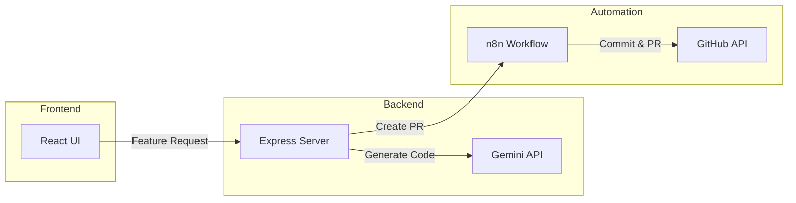
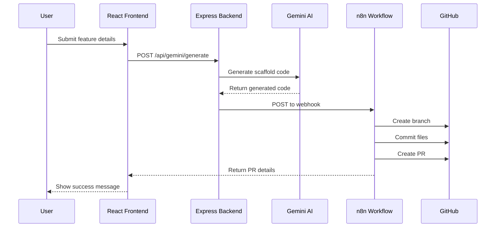

# Feature Scaffolding Agent

An AI-powered tool that generates feature scaffolds and creates pull requests automatically using Google's Gemini API.

## Overview

This project provides an end-to-end solution for automated feature scaffolding. Users can submit feature requirements through a React UI, which then uses Gemini AI to generate appropriate code templates. The system automatically creates a pull request in GitHub with the generated code via n8n workflow automation.

## Architecture



## Sequence Diagram



## Tech Stack

- **Frontend**: React 18 with TypeScript
- **Backend**: Express.js with TypeScript
- **AI Service**: Google Gemini API
- **Automation**: n8n workflow engine
- **Version Control**: GitHub API

## Prerequisites

- Node.js v16 or higher
- npm or yarn
- GitHub account and repository
- Google Cloud account with Gemini API access
- n8n instance running locally or hosted

## Installation

1. Clone the repository:
   ```bash
   git clone https://github.com/yourusername/feature-scaffold.git
   cd feature-scaffold
   ```

2. Set up the backend:
   ```bash
   cd backend
   npm install
   # Create .env file with:
   # GEMINI_API_KEY=your_gemini_api_key
   npm run dev
   ```

3. Set up the frontend:
   ```bash
   cd frontend
   npm install
   npm start
   ```

4. Configure n8n:
   - Import the workflow from `n8n/feature-scaffold-workflow.json`
   - Update the GitHub credentials in the workflow
   - Activate the workflow

## Project Structure

```
├── frontend/                 # React frontend
│   ├── public/              # Static files
│   └── src/                 # Source files
│       ├── components/      # React components
│       └── types/          # TypeScript types
├── backend/                 # Express backend
│   └── src/                # Source files
│       ├── routes/         # API routes
│       └── index.ts        # Server entry
└── n8n/                    # n8n workflow files
```

## Features

- **React UI Form**: Input feature requirements with name, description, and tech stack
- **Gemini AI Integration**: Generate code scaffolds using Google's Gemini API
- **Express Backend**: Handle API requests and coordinate with Gemini
- **n8n Automation**: Create GitHub branches, commits, and pull requests
- **GitHub Integration**: Automated PR creation with generated code

## Environment Variables

### Backend (.env)
```
GEMINI_API_KEY=your_gemini_api_key
PORT=3001
```

## Development

- Frontend runs on port 3000
- Backend runs on port 3001
- n8n webhook listens on port 5678

## API Endpoints

- `POST /api/gemini/generate`: Generate code scaffold using Gemini AI
- `POST /api/scaffold`: Create GitHub PR with generated code

## Contributing

1. Fork the repository
2. Create your feature branch (`git checkout -b feature/amazing-feature`)
3. Commit your changes (`git commit -m 'Add amazing feature'`)
4. Push to the branch (`git push origin feature/amazing-feature`)
5. Open a Pull Request

## License

This project is licensed under the MIT License.
