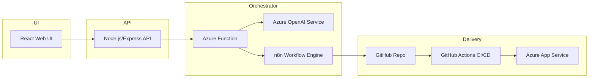
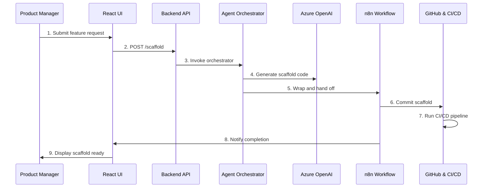

# Feature Scaffolding Agent

An AI-driven prototype that generates new feature boilerplate, CI/CD pipelines, and notifications in minutes.

---

## Overview

This repository contains a minimal end-to-end prototype demonstrating how to scaffold a new feature using AI and workflow automation. Users submit feature details through a React UI, and the system generates code templates, commits them to GitHub, and triggers a CI/CD pipeline. Notifications are sent via n8n to keep stakeholders informed.

---

## Architecture



---

## Sequence Diagram



---

## Prerequisites

- Node.js (v16 or higher)  
- npm or yarn  
- Azure Functions Core Tools (`npm install -g azure-functions-core-tools@4`)  
- Azure subscription with OpenAI access  
- n8n instance (self-hosted or cloud)  
- GitHub account and repository  

---

## Installation

1. Clone this repository  
   ```bash
   git clone https://github.com/yourorg/feature-scaffolding-agent.git
   cd feature-scaffolding-agent
   ```

2. Set up the Backend API  
   ```bash
   cd api
   npm install
   export AZURE_FUNCTION_URL=<your_azure_function_url>
   npm start
   ```

3. Set up the React UI  
   ```bash
   cd ../ui
   npm install
   npm start
   ```

4. Deploy Azure Function  
   ```bash
   cd ../orchestrator
   func azure functionapp publish <your_function_app_name>
   ```

5. Configure n8n Workflow  
   - Add HTTP Request Trigger for the orchestrator callback  
   - Add GitHub node to commit files  
   - Add notification node (Slack, Teams, etc.)

---

## Usage

1. Open the React UI in your browser  
2. Authenticate with GitHub if prompted  
3. Enter a feature name, description, and tech-stack choice  
4. Click **Generate Scaffold**  
5. Watch for a pull request in GitHub with the generated code  
6. Verify CI/CD pipeline execution and staging deployment  

---

## Component Breakdown

- **React Web UI**  
  Captures feature metadata and displays process status.

- **Node.js/Express API**  
  Validates input, handles authentication, and forwards requests.

- **Azure Function (Agent Orchestrator)**  
  Coordinates calls to the LLM and posts results to n8n.

- **Azure OpenAI Service**  
  Generates boilerplate code, configuration files, and tests.

- **n8n Workflow Engine**  
  Automates GitHub commits and stakeholder notifications.

- **GitHub Actions CI/CD**  
  Lints, tests, and deploys scaffolded code to Azure App Service.

---

## Next Steps

- Replace hard-coded prompts with dynamic template engine  
- Implement incremental status updates in the UI  
- Add error handling and retry logic in n8n  
- Extend scaffolding support to multiple languages and frameworks  
- Collect user feedback and refine LLM prompts  

---

## Contributing

1. Fork the repository  
2. Create a feature branch (`git checkout -b feature/name`)  
3. Commit your changes and push (`git push origin feature/name`)  
4. Open a pull request with a clear description  

---

## License

This project is licensed under the MIT License. See the [LICENSE](LICENSE) file for details.
